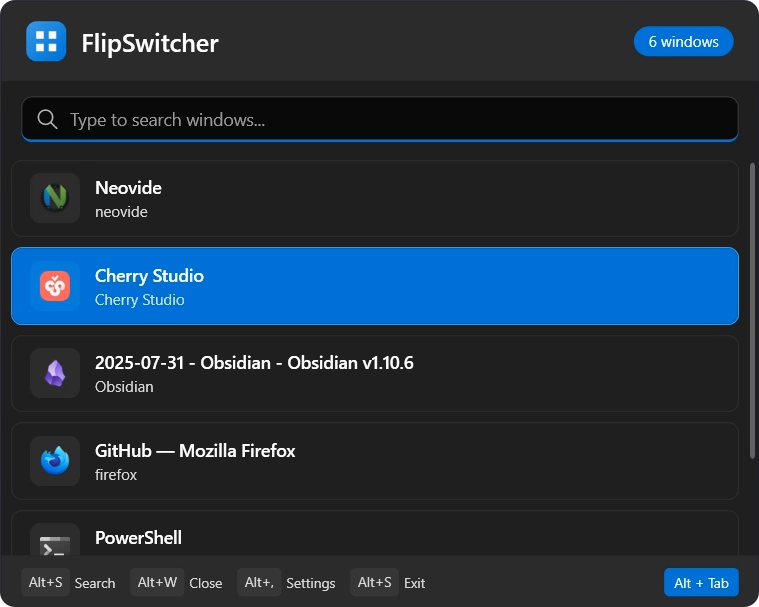

# FlipSwitcher

**[English](README.md) | [简体中文](README_zh-cn.md)**

<p align="center">
  
</p>

A modern, beautiful Alt-Tab replacement for Windows, built with **Fluent 2 Design System**.

## ✨ Features

- 🎨 **Fluent 2 Design** - Modern dark theme with Mica/Acrylic effects
- 🌓 **Theme Support** - Switch between dark and light themes (requires restart)
- ⚡ **Fast Window Switching** - Instantly switch between open windows
- 🔍 **Live Search** - Filter windows by title or process name as you type
- ⌨️ **Keyboard-First** - Designed for power users who love keyboard shortcuts
- 🖼️ **Window Icons** - Visual identification with application icons
- 💾 **Lightweight** - Minimal resource usage, runs in system tray

## 🚀 Getting Started

### Prerequisites

- Windows 10 (1903+) or Windows 11
- .NET 8.0 Runtime

### Installation

1. Download the latest release from [Releases](https://github.com/dianbanjiu/FlipSwitcher/releases)
2. Extract and run `FlipSwitcher.exe`
3. The app will start in the system tray

### Building from Source

```bash
# Clone the repository
git clone https://github.com/dianbanjiu/FlipSwitcher.git
cd FlipSwitcher

# Build the project
dotnet build -c Release

# Run
dotnet run --project FlipSwitcher
```

## ⌨️ Keyboard Shortcuts

| Shortcut      | Action                                                |
| ------------- | ----------------------------------------------------- |
| `Alt + Space` | Open/Close FlipSwitcher                               |
| `Alt + Tab`   | Open FlipSwitcher (optional, replaces system Alt+Tab) |
| `Alt + S`     | Enter search mode (keep window open)                  |
| `Alt + W`     | Close selected window                                 |
| `Alt + ,`     | Open settings                                         |
| `Alt + ->`    | Summary selected app                                  |
| `Alt + <-`    | Back to windows list                                  |

## 🎨 Design

FlipSwitcher is built following Microsoft's [Fluent 2 Design System](https://fluent2.microsoft.design/):

- **Mica Material** - Translucent background that adapts to desktop wallpaper
- **Rounded Corners** - Consistent 8px/12px corner radius
- **Segoe UI Variable** - Modern variable font for crisp typography
- **Theme Support** - Choose between dark and light themes in settings (restart required)
- **Subtle Animations** - Smooth transitions and hover effects

## 🏗️ Architecture

```
FlipSwitcher/
├── Assets/         # Application icons and images
├── Converters/     # WPF value converters
├── Core/           # Windows API interop (NativeMethods)
├── Models/         # Data models (AppWindow)
├── Properties/     # Publish profiles
├── Services/       # Business logic
├── Themes/         # Fluent 2 styles and colors (dark/light themes)
├── ViewModels/     # MVVM ViewModels
└── Views/          # WPF Windows (MainWindow, SettingsWindow)
```

## 🛠️ Technology Stack

- **WPF** - Windows Presentation Foundation
- **.NET 8.0** - Latest LTS framework
- **CommunityToolkit.Mvvm** - MVVM helpers
- **Hardcodet.NotifyIcon.Wpf** - System tray support

## 🙏 Acknowledgments

- Inspired by kvakulo [Switcheroo](https://github.com/kvakulo/Switcheroo) 
- Microsoft [Fluent 2 Design System](https://fluent2.microsoft.design/)
- [Segoe UI Variable](https://docs.microsoft.com/en-us/windows/apps/design/signature-experiences/typography) font

---

<p align="center">
  Made with ❤️ for Windows power users
</p>
