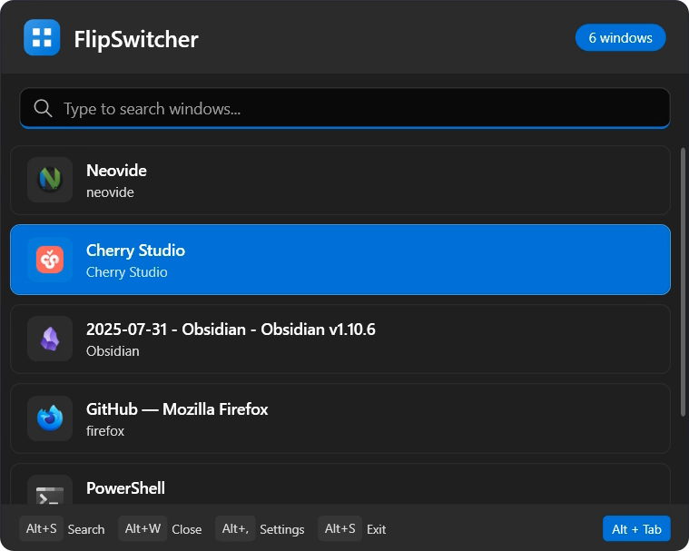

# FlipSwitcher

**[English](README.md) | [简体中文](README_zh-cn.md)**

<p align="center">
  
</p>

A modern, beautiful Alt-Tab replacement for Windows, built with **Fluent 2 Design System**.

## 🚀 Getting Started

### Prerequisites

- Windows 10 (1903+) or Windows 11

### Installation

1. Download `FlipSwitcher-windows-x64-Setup.exe` from [Releases](https://github.com/dianbanjiu/FlipSwitcher/releases/latest)
2. Run the installer and follow the prompts
3. The app will start in the system tray after installation

> 💡 **Tip**: If you need to close or terminate administrator-level windows or processes, it is recommended to enable "Run as Administrator" in Settings.

### Building from Source

```bash
# Clone the repository
git clone https://github.com/dianbanjiu/FlipSwitcher.git
cd FlipSwitcher

# Build the project
dotnet build -c Release

# Run
dotnet run --project FlipSwitcher
```

## ⌨️ Keyboard Shortcuts

| Shortcut      | Action                                                |
| ------------- | ----------------------------------------------------- |
| `Alt + Space` | Open/Close FlipSwitcher                               |
| `Alt + Tab`   | Open FlipSwitcher (optional, replaces system Alt+Tab) |
| `Alt + S`     | Enter search mode (keep window open)                  |
| `Alt + W`     | Close selected window                                 |
| `Alt + ,`     | Open settings                                         |
| `Alt + →`     | Group windows by selected app                         |
| `Alt + ←`     | Back to full window list                              |
| `Alt + D`     | Terminate the selected process                        |

## ✨ Features

- **Fast Search** - Quickly filter windows by typing
- **Pinyin Search** - Search Chinese window titles using pinyin initials or full pinyin (optional, disabled by default)
- **Multi-Monitor Support** - Show which monitor each window is on in multi-monitor setups (optional, disabled by default)
- **Window Grouping** - Press `Alt + →` to group and browse windows of the same application
- **Quick Close** - Close windows with `Alt + W` without leaving the switcher
- **Process Control** - Terminate processes with `Alt + D`
- **Theme Support** - Choose from Dark, Light, Catppuccin Latte, and Catppuccin Mocha themes; optionally follow the system theme automatically
- **Multi-Language** - Supports English, Simplified Chinese, and Traditional Chinese
- **Custom Font** - Configure your preferred font family in settings
- **Auto Update** - Optionally check for updates automatically on startup
- **Start with Windows** - Optionally launch FlipSwitcher on system startup
- **System Tray** - Runs quietly in the background, accessible from the tray

## 🛠️ Technology Stack

- **WPF** - Windows Presentation Foundation
- **.NET 8.0** - Latest LTS framework
- **CommunityToolkit.Mvvm** - MVVM helpers
- **Hardcodet.NotifyIcon.Wpf** - System tray support
- **TinyPinyin.Net** - Pinyin search support

## 🙏 Acknowledgments

- Inspired by kvakulo [Switcheroo](https://github.com/kvakulo/Switcheroo)
- Microsoft [Fluent 2 Design System](https://fluent2.microsoft.design/)
- [Segoe UI Variable](https://docs.microsoft.com/en-us/windows/apps/design/signature-experiences/typography) font
- [Inno Setup](https://jrsoftware.org/isinfo.php)
- [Catppuccin](https://catppuccin.com/palette/) color theme

---

<p align="center">
  Made with ❤️ for Windows power users
</p>
